<div align="center">

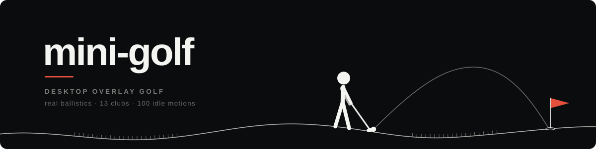

<p>


</p>

[한국어](README.md) · **English**

### Nine holes, quietly playing along the bottom of your screen.

Writing code or reading docs — the stickman walks across your windows and hits the ball.<br>
Every mouse click passes through to the app underneath, and the round keeps going while you work.

<br>

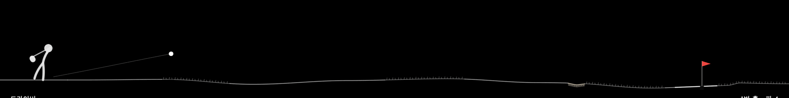

<sub><b>Driver tee shot</b> — 10.5° loft · 2,700 rpm backspin · real-time 240 Hz ballistics</sub>

</div>

<br>

## Installation

### A. Download — easiest

1. Download `MiniGolf-*.zip` from the **[latest release](https://github.com/w0uldy0udaestar/mini-golf/releases/latest)**
2. Unzip it and move `MiniGolf.app` to your **Applications** folder
3. The app is unsigned, so the first launch needs a one-time confirmation. On macOS 15 or later, try to open it once, then go to **System Settings → Privacy & Security → "Open Anyway"**. On macOS 13–14, **right-click → Open**

> If you see "is damaged and can't be opened", run this one line in Terminal:
> `xattr -dr com.apple.quarantine /Applications/MiniGolf.app`

### B. Homebrew

```sh
brew install --cask w0uldy0udaestar/tap/mini-golf
```

### C. Build from source (Swift 5.9+)

```sh
git clone https://github.com/w0uldy0udaestar/mini-golf.git
cd mini-golf
make app          # → dist/MiniGolf.app (universal binary)
open dist/MiniGolf.app
```

---

Once launched, **⛳️** appears in the menu bar and the game starts in the strip along the bottom of your desktop.
There is no Dock icon (menu bar only). Quit with <kbd>Esc</kbd> or right-click ⛳️ → Quit —
nothing keeps running in the background, and relaunching starts a new round.

There is no network access. The only things left on your Mac are two local files — settings and records (remove with `defaults delete io.github.w0uldy0udaestar.mini-golf`) and
a play log (`~/Library/Logs/MiniGolf/play.log`, safe to delete).

<br>

## Three things that set it apart

<table>
<tr>
<td width="33%" valign="top">

### An overlay that stays out of the way

A transparent `NSPanel` + a SpriteKit `.clear` scene.
Mouse events **all pass through**. The game takes the keyboard right after launch and when you click ⛳️ (including when your display setup changes);
click any other app and the keyboard goes back to it. Keystrokes are never recorded.

No Accessibility permission required. A summon shortcut is opt-in — set it yourself from the ⛳️ menu (no default).

</td>
<td width="33%" valign="top">

### Physics, not imitation

A fixed 240 Hz step integrates **drag, Magnus lift, and spin decay**.

With backspin still on it, the ball actually **spins back** after landing. Lip-outs are decided by speed, too.

</td>
<td width="33%" valign="top">

### A stickman with a life of its own

While walking, **42 idle motions** fire at random — every one a distinct silhouette on a skeleton with bending joints.

It leans into slopes, walks stiffly through the rough, and every so often falls flat on its face.

</td>
</tr>
</table>

<br>

## 42 idle motions + meme showpieces

<div align="center">

On the way to the ball, the stickman doesn't sit still.

<br>

<table>
<tr>
<td align="center">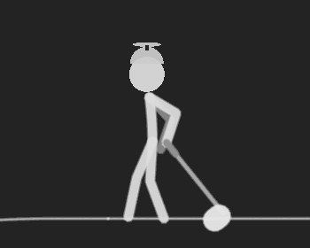<br><sub><code>twirl</code> — club twirl</sub></td>
<td align="center">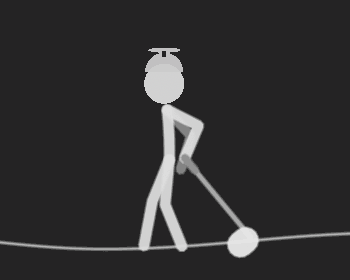<br><sub><code>helicopter</code> — helicopter</sub></td>
<td align="center">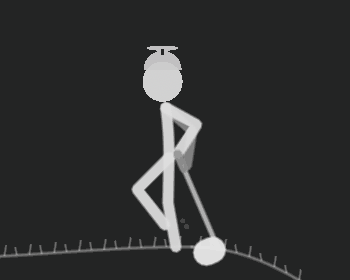<br><sub><code>clubSword</code> — club swordplay</sub></td>
</tr>
<tr>
<td align="center">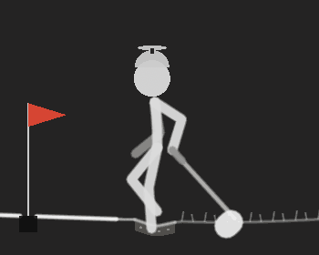<br><sub><code>hopscotch</code> — hopscotch</sub></td>
<td align="center">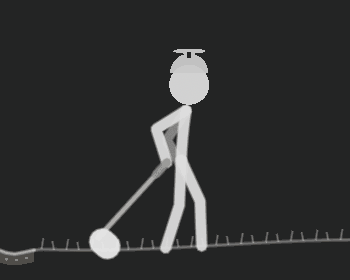<br><sub><code>crouchSneak</code> — tiptoe sneak</sub></td>
<td align="center">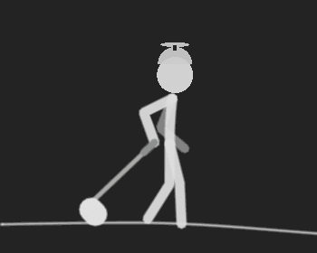<br><sub><code>cheer</code> — cheer jump</sub></td>
</tr>
</table>

And once in a while — **it stops walking and dances.**

<table>
<tr>
<td align="center">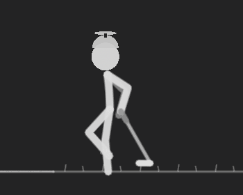<br><sub><code>siuJump</code> — leaping celebration</sub></td>
<td align="center">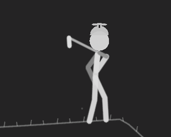<br><sub><code>horseDance</code> — horse-riding dance</sub></td>
<td align="center">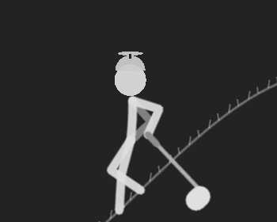<br><sub><code>whiffSpin</code> — whiff gag</sub></td>
</tr>
</table>

**[→ Full catalog: 42 idle motions + 12 meme showpieces](docs/motions.md)**

</div>

Motions are defined in `WalkFlavors.swift` as **silhouette recipes on top of the joints** — hand targets are set in polar coordinates
relative to the shoulder so the elbows fold, and some motions change the gait itself (stride, stops, jumps, tiptoes). The foot-contact (no-slip) gate is never touched.
Up to 5 per walk are scheduled without overlapping. **Meme showpieces** (aura farming, tung tung tung, scuba, Pikki Pikki-style…)
use the same continuous freeze ramp as falling over: the walk eases to a stop, the stickman dances big, then walks on — at most one per walk, 8% of the time.

<br>

## Physics engine

Every constant is real golf data normalized to screen scale, and it lives in `GolfCore`, separate from the UI.
The fixed step is deterministic, so **regressions are caught by unit tests**.

| Stage | Model |
|---|---|
| **Flight** | Gravity + drag (quadratic in speed, `Cd 0.25`) + Magnus lift |
| **Lift coefficient** | `Cl = 0.04 + 1.8 · (rω/v)`, capped at `0.35` — based on spin ratio |
| **Spin decay** | `dω/dt ∝ −v·ω` (Smits & Smith wind-tunnel data), decay rate clamped to `[0.01, 0.06]/s` |
| **Bounce** | Contact angular-momentum conservation model — turf friction `μ≈1.0` (based on Biber 2023 measurements) |
| **Roll** | Deceleration by lie: green `1.1` · fringe `1.6` · fairway `2.2` · rough `4.5` · bunker `8.0` m/s² |
| **Hole** | Captured at roll speed ≤ `3.6 m/s` · above `6.0 m/s` it lips out and runs past |
| **Step** | Fixed `1/240 s` — reproducible regardless of frame rate |

<details>
<summary><b>Data for all 13 clubs</b></summary>

<br>

| Club | Loft | Backspin | Ball speed | | Club | Loft | Backspin | Ball speed |
|---|---:|---:|---:|---|---|---:|---:|---:|
| Driver | 10.5° | 2,700 rpm | 69 m/s | | 7-iron | 34° | 7,000 rpm | 50 m/s |
| 3-wood | 15° | 3,600 rpm | 65 m/s | | 8-iron | 38° | 7,900 rpm | 47 m/s |
| 5-wood | 18° | 4,300 rpm | 62 m/s | | 9-iron | 42° | 8,500 rpm | 44 m/s |
| 3-iron | 21° | 4,600 rpm | 62 m/s | | Pitching wedge | 46° | 9,300 rpm | 41 m/s |
| 4-iron | 24° | 5,000 rpm | 59 m/s | | Sand wedge | 56° | 10,500 rpm | 35 m/s |
| 5-iron | 27° | 5,400 rpm | 56 m/s | | Putter | 0° | — | 13 m/s |
| 6-iron | 30° | 6,100 rpm | 53 m/s | | | | | |

More loft means more spin and less ball speed — wedges fly short and check up on backspin.

</details>

<br>

## The course

9 holes · par 36 total (par 3 ×2 · par 4 ×5 · par 5 ×2, shuffled). Each hole's length is the width of your screen, so the scale changes from hole to hole.

- **Dynamic terrain** — one archetype per hole (Cliff Tee · Summit Green · Canyon · Terraces · Valley · Ridge · Cascade · Forest). Elevations are set
  against real ball flight (one riser ≤ 14 m, a canyon is escapable with a single wedge), so you can carry the climbs, and descents make the hole play that much longer
- **Wind** — every hole has wind (usually up to 7 m/s with light breezes most common; Gale holes blow 4.5–8 m/s). Drag and lift are computed
  against airspeed, so a headwind cuts carry and a tailwind adds to it — read it from the flag and the
  HUD (`Wind → 3m/s` next to the club) and pick your club. Putts are unaffected. The `↑6m` next to the remaining distance is the elevation change to the cup
- **Surprises** — once in a while (up to five times a round) something happens. A bird makes off with your ball, a mole nudges it, a gust
  bends your trajectory, a mulligan card drops in, the stickman falls asleep if you leave the aim alone, a cat chases your **real mouse cursor**, a frog
  fishes your ball out of the water. Then the flag walks off and moves the cup,
  a delivery box turns out to hold a rubber ball or a bowling ball, a gallery shows up to cheer and jeer, and a gaggle of geese sits on your ball. A sprinkler pops up at the landing spot,
  the wind flips mid-flight, a caddie hands you a club, the cuckoo calls **on the hour by your real clock** (fireflies at night), and a puppy runs off
  with your ball — 16 in all, catalog in `docs/surprises.md`
- **Hole missions** — each hole carries a one-line goal: "Par or better without the driver", "Tee shot on the fairway", "Hit the green with a 5–8 iron",
  "Hit the green with a punch or lob", "From 40 m+, stop it inside 5 m"… 9 kinds. Most are decided within a shot or two, and progress shows in the middle of the strip at the bottom of the screen.
  Missions that hinge on distance or stroke count are simulated on that hole in that weather before they are assigned (no "Drive it past 250 m" on an uphill hole into the wind).
  Clear three to unlock the **Sun visor**
- **Hole weather** — the weather changes from hole to hole: clear (about six holes in ten) · **Rain** (the ball rolls less and greens are slower — drives roll about 40% less, carry is unchanged) ·
  **Gale** (4.5–8 m/s). The same bad weather never comes two holes in a row. Rain streaks and wind lines are drawn only just above the ground, so they never cover your work higher up the screen
- **Volcano greens** — two holes a round grow a cone where the green was (the first one almost always within holes 1–2). The cup sits in the crater on top:
  land it in the crater and it rolls into the cup; miss and it tumbles down the slope to the foot (standing at the foot selects a sand-wedge lob for you). Volcano holes are always clear weather
- **Records, badges, hats** — rounds add up: lifetime stats and 15 badges (First birdie · Hole in one · Canyon tamer · Valley walker · Cascade diver · Forest ranger ·
  Summiteer…), with your badge count **unlocking hats for the stickman** (Straw hat → Propeller cap → Top hat → Crown), and missions unlocking the Sun visor.
  New badges are announced after you start aiming on the next hole. ⛳️ menu → Records · Hat
- **Every hole is dynamic** — all 9 holes use **the full height of the screen**: a tee atop a cliff · a summit green ·
  a canyon (water at the bottom) · terraces · **Valley** (drop from the rim into a wide basin, then hit up to the green) · **Ridge** (a big hill in mid-fairway —
  come up short and you're on the slope, carry it and you get the downhill) · **Cascade** (a pond at the foot of each step down, a three-tier par 5) · **Forest** (a corridor of 3–4 trees — the stage for punches and lobs).
  Archetypes are dealt from a deck so a round stays varied (7 different ones across the 7 par-4 and par-5 holes), and the HUD hole title carries the name ("Hole 4 · Par 5 · Cascade"). Longer holes
  are drawn with up to 1.4× vertical exaggeration (physics stays in true meters; trees and rocks stay round). Steep slopes are rough, so the ball rolls down and always comes to rest on flat ground
- **Strategic hazards** — water · bunkers, placed using the driver's measured carry as an anchor
- **Obstacles** — trees · rocks. A punch shot under the canopy can get you through
- **Shot types** — pick with <kbd>Tab</kbd> (the word appears next to the club name in the HUD). A **Punch** flies low and runs (into the wind, under trees; a stinger
  with woods, a bump-and-run with wedges). A **Lob** goes high and stops quickly (elevated and island greens, over bunkers). Punches roll long
  and can run through the green; lobs come up short. No effect on the putter, and it resets to normal after each shot
- **Lies** — random bands of fairway and rough, plus a fringe in front of the green. In the rough, power ×0.75 and spin ×0.5 — but flat rough also mixes in patches of **flier lie**
  (spin comes off, the ball goes farther) and **deep rough** (grass grabs the club, short and high), named in the HUD lie readout
- **Slopes and undulation** — fairways roll, and the slope underfoot becomes your launch angle and stance. Uphill lies fly high and short,
  downhill lies fly low (physics and animation share the same constants)
- **Pins and greens** — the pin moves front, middle, and back, and greens come as two-tier (a top-tier pin you have to get over the step to reach), elevated (a raised green that rolls a short ball back down),
  and par-3 islands (water front and back)

<br>

## Controls

<div align="center">

| Input | Action |
|:---:|:---|
| <kbd>←</kbd> <kbd>→</kbd> | Change club &nbsp;<sub>→ goes toward the driver = longer</sub> |
| <kbd>↑</kbd> <kbd>↓</kbd> | Backswing height = power |
| <kbd>Tab</kbd> | Shot type &nbsp;<sub>normal → Punch → Lob, resets every shot</sub> |
| <kbd>Space</kbd> | Swing |
| <kbd>R</kbd> | New round |
| <kbd>Esc</kbd> | Quit |

</div>

Menu bar **⛳️ left-click** = resume / pause · **right-click** = menu (New Round · Driving Range · Sound · High Contrast · Hat · Swing Style · Records · Display ·
Set summon shortcut… · 언어 · Language · Quit)

**Driving Range**: right-click ⛳️ → **Driving Range**. Hit from a single flat line, switching clubs as you go: a club marker stays where each ball stops, carry and total distance are shown,
and then the ball returns to the tee. Records, missions, weather, and surprises are off. Press <kbd>R</kbd> or use the menu to go back to the round.

**Summon shortcut**: right-click ⛳️ → **Set summon shortcut…**, then press the key combination you want — two or more modifiers including ⌃ or ⌥
(e.g. ⌃⌥G). From any app, that combination brings the game up; press it again to send the game back to rest and return to the app you were using. There is no default.
The game receives a registered combination **ahead of every other app** — macOS does not report clashes with other apps' shortcuts, so pick one you don't otherwise use.
Single-modifier combinations such as ⌘C and macOS system shortcuts (Spotlight, input-source switching, and so on) are not accepted.

**Language**: right-click ⛳️ → **언어 · Language**. By default it follows your system setting (한국어 / English).

**Multiple displays**: right-click ⛳️ → **Display** and pick the screen for the game. The hole in progress
carries on, and your choice is remembered (if that display is disconnected, the game moves back to the main display automatically).

Clicking another window only releases the keyboard — the game keeps going. Click ⛳️ to play again.

> **Light background tip** — hairlines disappear on white windows. Right-click → turn on **High Contrast**.

<br>

## Design principles

> **The background belongs to you.** The game doesn't paint over your desktop.

- **A quiet instrument panel** — a type-driven HUD with no boxes or panels, and hairline terrain
- **Exactly one accent color** — flag red. Everything else is shades of gray
- **No numeric assists** — no launch angle, no predicted distance. That's where the fun of golf is
- **Synthesized sound** — zero external samples. Strikes, bounces, hole-outs, and lip-outs are all synthesized in real time

<br>

## Development

```sh
swift build          # debug build
swift test           # 126 XCTest cases (ballistic invariants · lip-out boundaries · course stats · balance bot · pose invariants · mission rules · weather physics · trick greens · save-format compatibility)
swiftformat --lint . # style check
```

On every push and PR, GitHub Actions (`.github/workflows/ci.yml`, macOS runner) runs the same three steps.
Observation and debug flags are parsed in one place: `Sources/MiniGolf/DemoOptions.swift`.

```
Sources/GolfCore/    physics · course generation — zero UI dependencies, deterministic (under test)
Sources/MiniGolf/    app · rendering — AppKit overlay + SpriteKit scene · stickman · HUD · sound
Tests/               ballistic regressions · course generation statistics
docs/                motion catalog · QA report · research notes
```

**No dependencies** — pure Swift and system frameworks only (AppKit · SpriteKit · AVFoundation). About 13,000 lines.

<details>
<summary><b>Demo and debug flags</b></summary>

<br>

| Flag | Purpose |
|---|---|
| `--demo` | Autoplay (for watching motions; sound off) |
| `--demo-motions` | Plays all 42 motions in order — for capturing the catalog |
| `--demo-pickup` | Watch the ball pickup ritual (starts in front of the cup) |
| `--demo-settle` | Watch a ball settle on a steep slope (the first shot drops at the top of the riser on the hole side — a canyon seed — check each seed's layout with `swift test --filter testSignatureSeedDiscovery`) |
| `--demo-power P` | Fix the bot's power (0.05–1; reproduces real-play conditions such as a full-power finish) |
| `--demo-restart-after-holed T` | New round (R) T seconds after the first hole-out — watch the hole-transition timer get interrupted |
| `--demo-hole N` | Start a new round at hole N (for watching mirrored holes or a specific archetype; use with `--seed`) |
| `--demo-ball X` | Put the ball at X m at the start of the hole (watch the address pose for a specific lie and distance, e.g. `--demo-idle --club SW --demo-power 0.43`) |
| `--demo-turn` | Drops the first shot 22 m behind to watch the walk reverse direction (turning in place at departure and arrival) — log `TURN start/flip/arrival` |
| `--demo-mood M` | Force a mood on every walk (`elated` / `sad` / `neutral`) — random idle motions off, log `MOOD` |
| `--demo-replan` | Moves the ball mid-walk (first 12 m ahead → continuous replan `REPLAN`; then 25 m behind → restart after arriving `REWALK` + turn in place) |
| `--demo-memes` | Cycles through all 12 meme showpieces |
| `--seed N` | Fix the course seed |
| `--weather W` | Force one weather on all nine holes (`clear` / `rain` / `gale`) — works outside observation modes too |
| `--gimmick K` | Put that trick green on every hole it fits (`volcano` / `funnel` — the punchbowl is out of the rotation and only shows here) — works outside observation modes too |
| `--lang L` | Set the display language (`ko` / `en`, not saved) |
| `--mission KIND` | Put that mission on every hole (`noDriver` · `fairwayTee` · `longDrive` · `greenInReg` · `midIronGreen` · `shapeShot` · `closeApproach` · `noBunker` · `birdie`) |
| `--demo-range` | Start in the driving range, cycling clubs every shot (watch the scale ticks and markers) |
| `--demo-notice` | Sample badge notice on every hole-out — check that it appears after you start aiming on the next hole (log `NOTICE`) |
| `--demo-hotkey-ui` | Opens the shortcut-recording dialog and feeds it a sample combination (no key input, log `HOTKEYUI`) |
| `--demo-wall` | Watch the wall-reflection stance |
| `--demo-trip` | Force a trip |
| `--demo-slip` | Force a finish fall regardless of power on a sloped lie (above 0.03) — for watching slope falls |
| `--demo-idle` | Hold the aim — watch idle motions |
| `--demo-card` | Scorecard preview |
| `--no-wall-clamp` | Disable the render-bounds clamp (for checking overruns) |
| `--screen N` | Choose the display at launch (from 0, not saved) |
| `--demo-switch T` | Move to the next display after T seconds (for watching the switch) |

Instrumentation logs: `AIM` · `FLAVOR[epoch]` · `MOTION` · `HOLED` · `OUTBOUND`

</details>

<br>

## Roadmap

- [x] Ballistics engine · 9-hole course generation · scorecard
- [x] Quiet instrument-panel HUD · synthesized sound · trajectory FX
- [x] Jointed stickman skeleton (2-bone IK) · 42 motions · terrain-aware walking · emotional reactions
- [x] 3 pro swing styles (Rory · Tiger · Bryson, keypoints measured from face-on video) — ⛳️ menu → Swing Style
- [x] Player trademark touches — Tiger's club twirl and uppercut, Bryson's straight arms and arm-lock putting, Rory's impact jump and finish recoil
- [x] Multiple displays — pick and remember from ⛳️ menu → Display
- [x] 9 hole missions · hole-by-hole weather (Rain · Gale)
- [x] Trick greens, first batch (Volcano — Punchbowl left out of the rotation)
- [x] Driving range — carry and total distance per club
- [x] Custom summon shortcut — set it yourself from the ⛳️ menu
- [x] English UI — ⛳️ menu → Language
- [ ] Cross-platform (Windows · Linux) — undecided. The Swift/AppKit stack would need a separate rewrite

<br>

## Requirements

macOS 13 (Ventura) or later · Apple Silicon / Intel · Swift 5.9+ (Xcode 15+)
No Accessibility permission **required**.

<br>

---

<div align="center">
<sub>

**MIT License** · Made with real ballistic physics and far too many walking animations

Timing and poses for the golf ritual motions reference measurements from the [CMU Graphics Lab Motion Capture Database](http://mocap.cs.cmu.edu)
(NSF EIA-0196217)

</sub>
</div>
