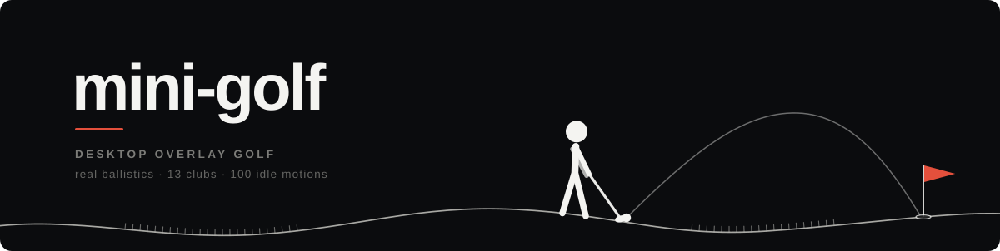
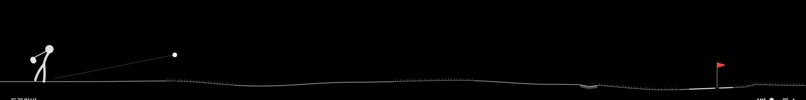
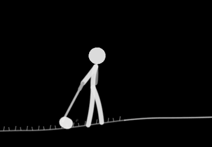
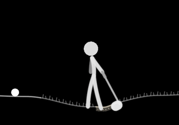
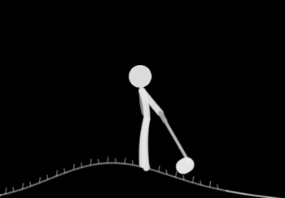
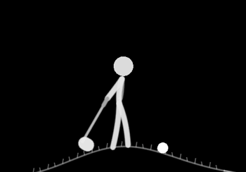
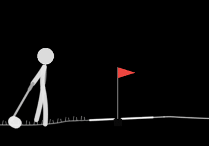
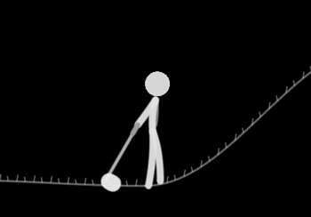

<div align="center">



<p>


</p>

### 화면 맨 아래 띠에서, 9홀이 조용히 돌아갑니다.

코드를 쓰든 문서를 보든 — 스틱맨은 당신의 창 위를 걸어 공을 칩니다.<br>
마우스 클릭은 전부 아래 앱으로 통과하고, 라운드는 일하는 동안 계속 흘러갑니다.

<br>



<sub><b>드라이버 티샷</b> — 로프트 10.5° · 백스핀 2,700rpm · 실시간 240Hz 탄도 시뮬레이션</sub>

</div>

<br>

## 설치

### A. 다운로드 — 가장 쉬움

1. **[최신 릴리스](https://github.com/w0uldy0udaestar/mini-golf/releases/latest)**에서 `MiniGolf-*.zip` 다운로드
2. 압축을 풀고 `MiniGolf.app`을 **응용 프로그램** 폴더로 이동
3. 첫 실행은 **우클릭 → 열기** (서명되지 않은 앱이라 한 번은 확인이 필요합니다)

> "손상되었기 때문에 열 수 없습니다"가 뜨면 터미널에서 한 줄:
> `xattr -cr /Applications/MiniGolf.app`

### B. Homebrew

```sh
brew install --cask w0uldy0udaestar/tap/mini-golf
```

### C. 소스 빌드 (Swift 5.9+)

```sh
git clone https://github.com/w0uldy0udaestar/mini-golf.git
cd mini-golf
make app          # → dist/MiniGolf.app (유니버설 바이너리)
open dist/MiniGolf.app
```

---

실행하면 메뉴바에 **⛳️** 가 뜨고 게임은 데스크탑 맨 아래 띠에서 시작됩니다.
Dock 아이콘은 없습니다(메뉴바 전용). 종료는 <kbd>Esc</kbd> 또는 ⛳️ 우클릭 → 종료 —
백그라운드에 아무것도 남지 않고, 다시 켜면 새 라운드입니다.

<br>

## 세 가지가 다릅니다

<table>
<tr>
<td width="33%" valign="top">

### 방해하지 않는 오버레이

투명 `NSPanel` + SpriteKit `.clear` 씬.
마우스 이벤트는 **전부 통과**하고, 게임이 키보드를 잡는 건 ⛳️를 눌렀을 때뿐입니다.

접근성 권한도, 전역 단축키도 필요 없습니다.

</td>
<td width="33%" valign="top">

### 흉내가 아닌 물리

240Hz 고정 스텝으로 **항력·마그누스 양력·스핀 감쇠**를 적분합니다.

백스핀이 살아 있으면 공은 착지 후 실제로 **뒤로 물러납니다**. 립아웃도 속도로 판정합니다.

</td>
<td width="33%" valign="top">

### 살아 있는 스틱맨

걷는 동안 **100종의 잔동작**이 랜덤으로 발동합니다.

경사에선 몸을 기울이고, 러프에선 뻣뻣하게, 아주 가끔은 철푸덕 넘어집니다.

</td>
</tr>
</table>

<br>

## 100가지 잔동작

<div align="center">

공을 향해 걸어가는 동안, 스틱맨은 가만히 있지 않습니다.

<br>

<table>
<tr>
<td align="center"><br><sub><code>twirlTriple</code> — 세 바퀴 트월</sub></td>
<td align="center"><br><sub><code>clubHelicopter</code> — 헬리콥터</sub></td>
<td align="center"><br><sub><code>moonBounce</code> — 달에서 걷기</sub></td>
</tr>
<tr>
<td align="center"><br><sub><code>butterflyWatch</code> — 나비 쫓기</sub></td>
<td align="center"><br><sub><code>shadowBox</code> — 섀도복싱</sub></td>
<td align="center"><br><sub><code>zen</code> — 잠시 도를 닦는다</sub></td>
</tr>
</table>

**[→ 100종 전체 카탈로그 보기](docs/motions.md)**

</div>

모션은 `WalkFlavors.swift`에 **채널 엔벨로프 레시피**로 정의됩니다 — 머리·어깨·팔·클럽·상체 각 채널에
시간 곡선을 합산하는 방식이라, 걷기 사이클이나 발 접지(노슬립) 게이트를 건드리지 않고 겹쳐 쓸 수 있습니다.
걷기 한 번에 최대 5개가 겹치지 않게 스케줄됩니다.

<br>

## 물리 엔진

모든 상수는 실제 골프 데이터를 화면 스케일로 정규화한 값이고, `GolfCore`에 UI와 분리되어 있습니다.
결정론적 고정 스텝이라 **회귀를 단위 테스트로 잡습니다**.

| 단계 | 모델 |
|---|---|
| **비행** | 중력 + 항력(속도 2차, `Cd 0.25`) + 마그누스 양력 |
| **양력 계수** | `Cl = 0.04 + 1.8 · (rω/v)`, 상한 `0.35` — 스핀비 기반 |
| **스핀 감쇠** | `dω/dt ∝ −v·ω` (Smits & Smith 풍동 데이터), 감쇠율 `[0.01, 0.06]/s` 클램프 |
| **바운스** | 접지 각운동량 보존 모델 — 잔디 마찰 `μ≈1.0` (Biber 2023 실측 기반) |
| **굴림** | 라이별 감속: 그린 `1.1` · 에이프런 `1.6` · 페어웨이 `2.2` · 러프 `4.5` · 벙커 `8.0` m/s² |
| **홀** | 굴림 `3.6 m/s` 이하 캡처 · `6.0 m/s` 초과는 립아웃 후 통과 |
| **스텝** | 고정 `1/240 s` — 프레임레이트와 무관하게 재현 가능 |

<details>
<summary><b>클럽 13종 데이터 테이블</b></summary>

<br>

| 클럽 | 로프트 | 백스핀 | 볼스피드 | | 클럽 | 로프트 | 백스핀 | 볼스피드 |
|---|---:|---:|---:|---|---|---:|---:|---:|
| 드라이버 | 10.5° | 2,700 rpm | 75 m/s | | 7번 아이언 | 34° | 7,000 rpm | 50 m/s |
| 3번 우드 | 15° | 3,600 rpm | 70 m/s | | 8번 아이언 | 38° | 7,900 rpm | 47 m/s |
| 5번 우드 | 18° | 4,300 rpm | 66 m/s | | 9번 아이언 | 42° | 8,500 rpm | 44 m/s |
| 3번 아이언 | 21° | 4,600 rpm | 62 m/s | | 피칭 웨지 | 46° | 9,300 rpm | 41 m/s |
| 4번 아이언 | 24° | 5,000 rpm | 59 m/s | | 샌드 웨지 | 56° | 10,500 rpm | 35 m/s |
| 5번 아이언 | 27° | 5,400 rpm | 56 m/s | | 퍼터 | 0° | — | 13 m/s |
| 6번 아이언 | 30° | 6,100 rpm | 53 m/s | | | | | |

로프트가 커질수록 스핀이 붙고 볼스피드가 떨어집니다 — 웨지는 짧게 날아가 백스핀으로 멈춰 섭니다.

</details>

<br>

## 코스

9홀 · 파 합계 36 (파3 ×2 · 파4 ×5 · 파5 ×2 셔플). 홀마다 화면 폭이 곧 홀 전장이라 스케일이 달라집니다.

- **다이나믹 지형** — 홀마다 성격 롤(능선 · 분지 · 플래토 · 솟은 그린 · 낮은 그린), 평균 낙차 12m
- **전략적 해저드** — 드라이버 실측 도달 거리를 앵커로 배치되는 워터 · 벙커
- **장애물** — 나무 · 바위. 캐노피 밑으로 펀치샷을 보내면 넘어갈 수 있습니다
- **라이** — 페어웨이 · 러프 랜덤 밴드 + 그린 앞 에이프런. 러프에선 파워 ×0.75, 스핀 ×0.5
- **경사** — 발밑 기울기가 발사각과 스탠스에 함께 반영됩니다 (물리와 애니메이션이 같은 상수를 공유)

<br>

## 조작

<div align="center">

| 입력 | 동작 |
|:---:|:---|
| <kbd>←</kbd> <kbd>→</kbd> | 클럽 변경 &nbsp;<sub>→ 가 드라이버 쪽 = 멀리</sub> |
| <kbd>↑</kbd> <kbd>↓</kbd> | 백스윙 높이 = 파워 |
| <kbd>Space</kbd> | 스윙 |
| <kbd>R</kbd> | 새 라운드 |
| <kbd>Esc</kbd> | 종료 |

</div>

메뉴바 **⛳️ 좌클릭** = 재개 / 일시정지 · **우클릭** = 메뉴(사운드 · 고대비 모드 · 새 라운드 · 종료)

다른 창을 클릭하면 키보드만 놓아줍니다 — 게임은 계속 흐릅니다. 다시 치려면 ⛳️.

> **밝은 배경 팁** — 흰 창 위에선 헤어라인이 묻힙니다. 우클릭 → **고대비 모드**를 켜세요.

<br>

## 디자인 원칙

> **배경은 사용자 영역이다.** 게임은 데스크탑을 칠하지 않습니다.

- **조용한 계기판** — 상자도 패널도 없는 타이포 중심 HUD, 헤어라인 지형
- **포인트 컬러는 딱 하나** — 깃발 레드. 나머지는 전부 회색 계조
- **수치 어시스트 없음** — 탄도각도 예상 비거리도 보여주지 않습니다. 골프의 매력은 거기 있으니까
- **합성 사운드** — 외부 샘플 0개. 타구음·바운스·홀인·립아웃을 전부 실시간 합성

<br>

## 개발

```sh
swift build          # 디버그 빌드
swift test           # XCTest 32종 (탄도 불변식 · 립아웃 경계 · 코스 통계 · 회귀)
swiftformat --lint . # 스타일 검사
```

```
Sources/GolfCore/    물리 · 코스 생성 — UI 의존 0, 결정론적 (테스트 대상)
Sources/MiniGolf/    앱 · 렌더 — AppKit 오버레이 + SpriteKit 씬 · 스틱맨 · HUD · 사운드
Tests/               탄도 회귀 · 코스 생성 통계 검증
docs/                모션 카탈로그 · QA 보고서 · 리서치 노트
```

**의존성 없음** — 순수 Swift와 시스템 프레임워크(AppKit · SpriteKit · AVFoundation)만 씁니다. 약 4,000줄.

<details>
<summary><b>데모 · 디버그 플래그</b></summary>

<br>

| 플래그 | 용도 |
|---|---|
| `--demo` | 자동 플레이 (모션 관찰용, 사운드 꺼짐) |
| `--demo-motions` | 모션 100종을 순서대로 시연 — 이 저장소의 GIF 카탈로그가 이걸로 캡처됐습니다 |
| `--seed N` | 코스 시드 고정 |
| `--demo-wall` | 벽 반사 스탠스 관찰 |
| `--demo-trip` | 넘어지기 강제 |
| `--demo-idle` | 조준 유지 — 아이들 잔동작 관찰 |
| `--demo-card` | 스코어카드 미리보기 |
| `--no-wall-clamp` | 렌더 경계 클램프 해제 (침범 검증용) |

계측 로그: `AIM` · `FLAVOR[epoch]` · `MOTION` · `HOLED` · `OUTBOUND`

</details>

<br>

## 로드맵

- [x] 탄도 엔진 · 9홀 코스 생성 · 스코어카드
- [x] 조용한 계기판 HUD · 합성 사운드 · 궤적 FX
- [x] 스틱맨 모션 100종 · 지형 적응 걷기 · 감정 반응
- [ ] 크로스플랫폼 (Windows · Linux) — 투명 클릭스루 창과 렌더 백엔드 설계 중
- [ ] 멀티 모니터 · 사용자 지정 전역 단축키

<br>

## 요구 사항

macOS 13 (Ventura) 이상 · Apple Silicon / Intel · Swift 5.9+ (Xcode 15+)
별도 접근성 권한 **불필요**.

<br>

---

<div align="center">
<sub>

**MIT License** · 실제 탄도 물리와 지나치게 많은 걷기 애니메이션으로 만들었습니다

</sub>
</div>
