# 걷기 랜덤 모션 카탈로그 (100종)

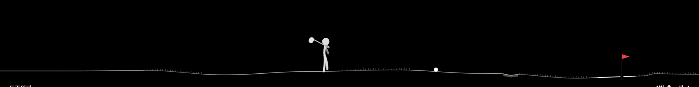

스틱맨이 공을 향해 걷는 동안 확률적으로 발동하는 잉여 동작 전체 목록.
모든 모션은 `WalkFlavors.swift`의 채널 엔벨로프 레시피로 정의되며, 발 접지 게이트(노슬립)는
건드리지 않는다. 진폭은 `boostMotion(1.7)`로 일괄 증폭 (2026-08-20 사용자 판정 "동작이
완전 커야" — 오프셋 채널만, 트월 회전수·기능 포즈는 보존). GIF는 `--demo-motions` 시연 모드에서 실플레이를 프레임 캡처해 스틱맨 추적 크롭으로 조립한 것.

발동 규칙: 걷기당 최대 5개, 겹치지 않게 스케줄. 어깨 캐리 중엔 클럽 모션 금지.
별개로 아주 가끔(1~2%) [철푸덕 넘어지기](qa-report-2026-08-15.md)가 있다.

## 쇼피스 밈 모션 (12) — 걷기를 멈추고 춘다

잔동작과 달리 **걸음을 서서히 멈추고**(트립과 같은 연속 동결 램프) 2~3초 크게 추는
희귀 이벤트. 걷기가 넉넉할 때 8%, 걷기당 최대 1개, 트립·잔동작과 겹치지 않는다.
밈 리서치(2026-08) 기반 — 실루엣 판독성과 골프 클럽 시너지 우선, 동작은 오마주 수준으로
추상화(특정 게임 이모트 명칭 미사용). 시연: `--demo-memes`(12종 순환).

| 모션 | 설명 | 모습 |
|---|---|---|
| whiffSpin | 헛스윙 개그 — 진지한 어드레스, 헛스윙, 아무렇지 않게 잔댄스 | 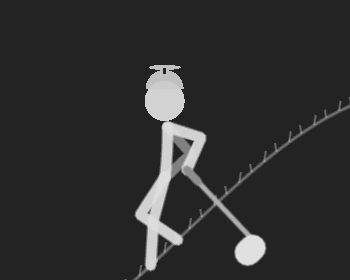 |
| auraFarm | 아우라 파밍 — 클럽 짚고 낮게, 스윕마다 정지 홀드 | 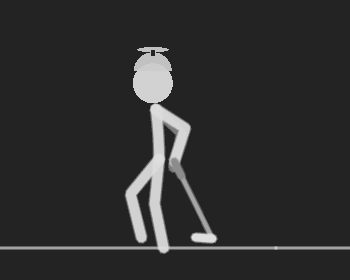 |
| siuJump | 도약 세리머니 — 웅크림, 점프, 양팔 뒤로 착지 홀드 | 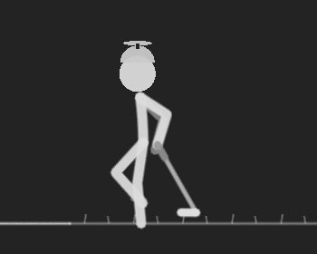 |
| tripleBeat | 퉁퉁퉁 — 클럽 수직 3연타 찍기, 마무리는 어깨에 척 | 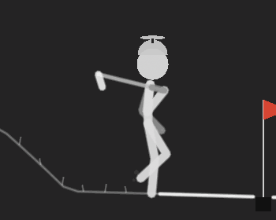 |
| scubaDance | 스쿠버 — 한 손 코 막고 바운스, 클럽 부채질 | 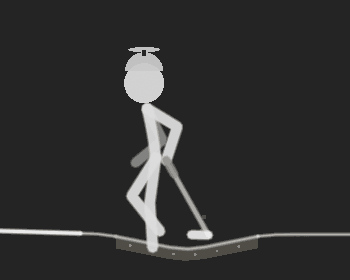 |
| heelGroove | 힐 그루브 — 뒤꿈치 바운스 8박 + 자유팔 루프 | 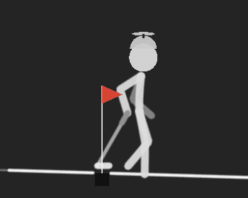 |
| dabPose | 댑 — 스냅으로 고개 파묻고 클럽 팔 사선 홀드 | 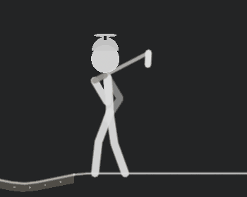 |
| horseDance | 말춤 — 양손 고삐 바운스 + 올가미 (K-클래식) | 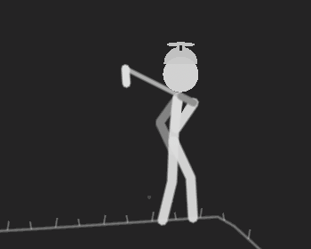 |
| coffinMarch | 관짝 행진 — 클럽 어깨에 메고 제자리 바운스 | 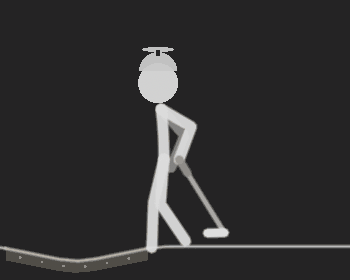 |
| clubFlip | 클럽 플립 — 던져서 수직 착지, 짜잔 | 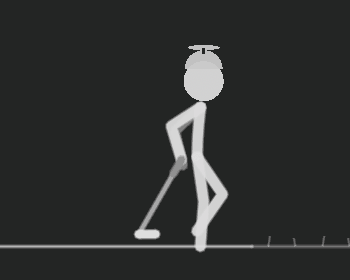 |
| freezeFrame | 마네킹 — 걷다가 완전 정지 3초, 끝에 두리번 | 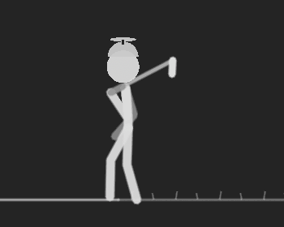 |
| cheerSeesaw | 응원 시소 — 양손 교대 상하 + 힙 리듬 (삐끼삐끼풍) | 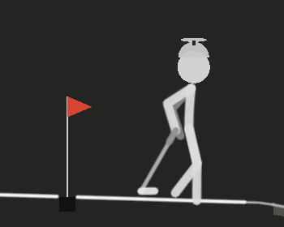 |

## 클럽 트월·곡예 (14)

| 모션 | 설명 | 모습 |
|---|---|---|
| twirl | 클럽 한 바퀴 트월 | 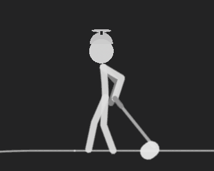 |
| twirlDouble | 두 바퀴 트월 | 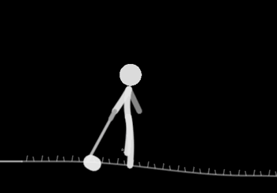 |
| twirlReverse | 역방향 트월 | 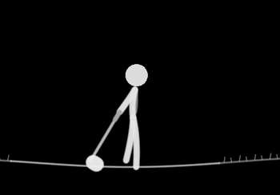 |
| twirlTriple | 세 바퀴 — 곡예급 |  |
| twirlHigh | 높이 들고 트월 | 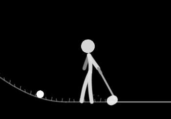 |
| twirlLow | 낮게 웅크려 트월 | 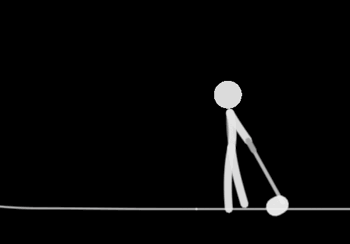 |
| wristRoll | 손목 까딱까딱 | 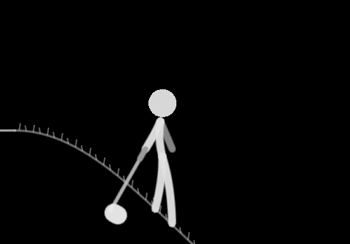 |
| clubRaise | 클럽 살짝 들기 | 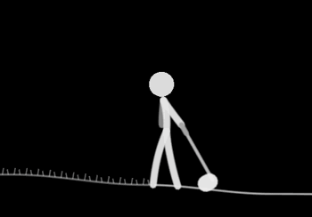 |
| clubTapShoulder | 어깨에 톡톡 | 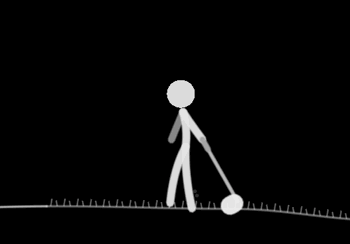 |
| clubPoint | 전방 지목 — "저기다" | 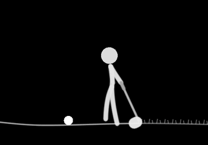 |
| clubPointHold | 길게 겨눈다 | 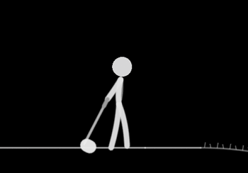 |
| clubBalance | 수직으로 세워 균형 잡기 | 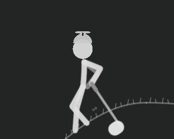 |
| clubConduct | 오케스트라 지휘 | 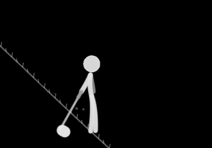 |
| clubHelicopter | 헬리콥터 — 들고 두 바퀴 |  |

## 에어 골프·클럽 장난 (6)

| 모션 | 설명 | 모습 |
|---|---|---|
| airSwingMini | 걸으며 미니 연습 스윙 | 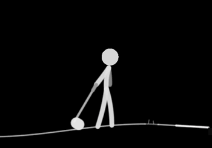 |
| airPutt | 퍼팅 스트로크 흉내 | 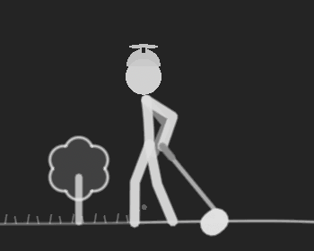 |
| clubInspect | 헤드를 눈앞에 들고 살핀다 | 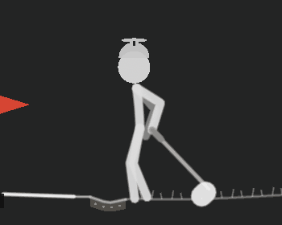 |
| clubSpinCatch | 반 바퀴 돌렸다 잡기 | 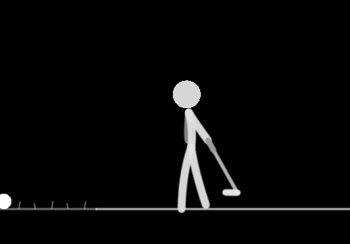 |
| clubBat | 야구 타격 자세 장난 | 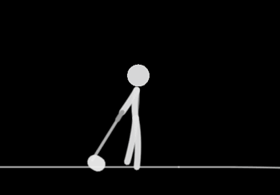 |
| clubSword | 검처럼 겨누기 (잔떨림) | 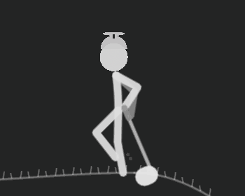 |

## 머리·시선 (12)

| 모션 | 설명 | 모습 |
|---|---|---|
| lookBack | 뒤돌아보기 | 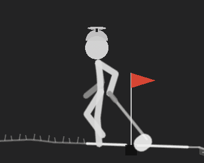 |
| lookBackLong | 오래 뒤돌아보기 | 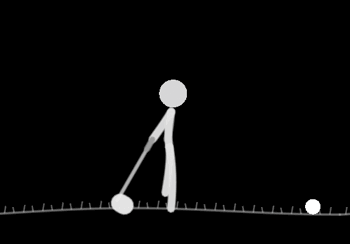 |
| lookSky | 하늘 보기 | 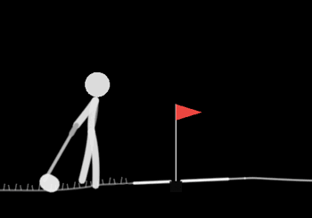 |
| lookHole | 홀 쪽 응시 | 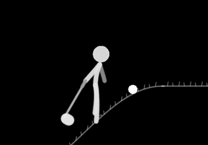 |
| headBob | 머리 까딱까딱 | 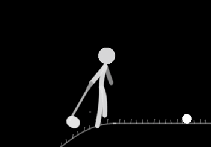 |
| headTilt | 갸웃 | 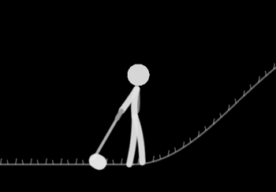 |
| lookDown | 풀 관찰 | 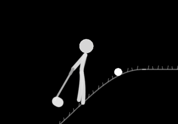 |
| doubleTake | 봤다가, 다시 한 번 | 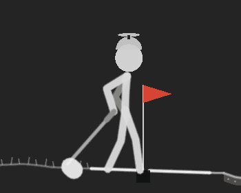 |
| nodYes | 끄덕끄덕 | 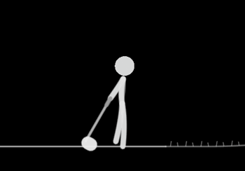 |
| shakeNo | 절레절레 | 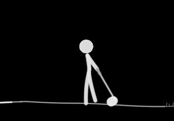 |
| birdWatch | 새를 따라가는 시선 | 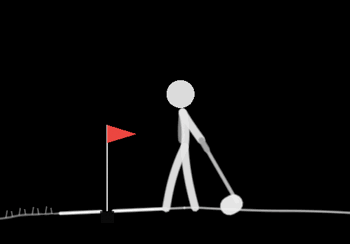 |
| stargaze | 별 구경 | 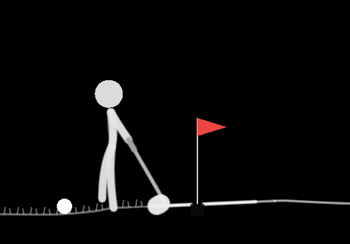 |

## 팔·손 (12)

| 모션 | 설명 | 모습 |
|---|---|---|
| hatTouch | 모자 만지기 | 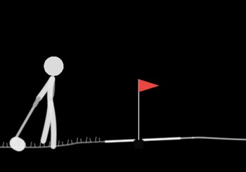 |
| armSwing | 팔 스윙 크게 | 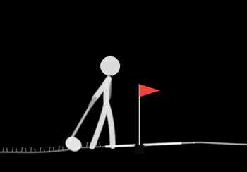 |
| armSwingBig | 팔 스윙 아주 크게 | 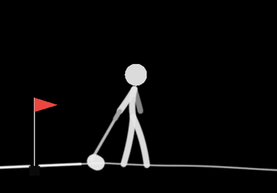 |
| fistPump | 주먹 불끈 | 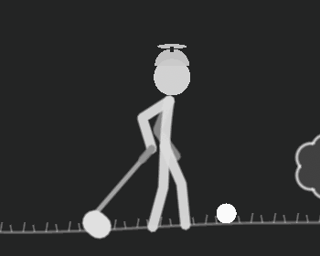 |
| fistPumpDouble | 주먹 두 번 | 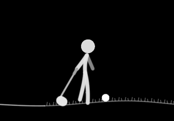 |
| wave | 손 흔들기 — 관객 인사 | 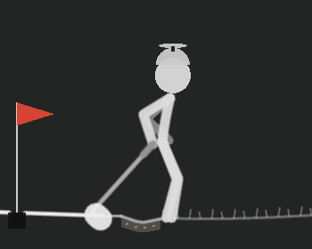 |
| waveBig | 크게 흔들기 | 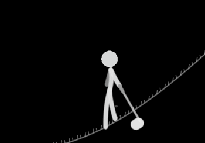 |
| airDrum | 에어 드럼 |  |
| scratchHead | 머리 긁적 |  |
| pointAhead | 손가락 지목 |  |
| shadowBox | 섀도복싱 |  |
| palmCheck | 손금 보기 |  |

## 상체·자세 (14)

| 모션 | 설명 | 모습 |
|---|---|---|
| shrug | 으쓱 |  |
| slump | 축 처짐 |  |
| stretch | 기지개 |  |
| chestPuff | 가슴 활짝 — 으스대기 |  |
| leanBack | 뒤로 젖히기 |  |
| leanForward | 앞으로 기울기 |  |
| bowSlight | 목례 |  |
| squatDip | 살짝 스쿼트 |  |
| squatDeep | 깊은 스쿼트 |  |
| torsoTwist | 몸통 비틀기 |  |
| shoulderRoll | 어깨 돌리기 |  |
| neckStretch | 목 스트레칭 |  |
| backArch | 허리 젖혀 기지개 |  |
| wiggle | 옴찔옴찔 |  |

## 리듬·스텝 (16)

| 모션 | 설명 | 모습 |
|---|---|---|
| skip | 폴짝 |  |
| skipJoy | 신나는 폴짝 |  |
| hipSway | 힙 흔들기 |  |
| bounce | 통통 바운스 |  |
| moonBounce | 달 위를 걷듯 느린 큰 바운스 |  |
| strut | 으스대는 걸음 |  |
| shimmy | 어깨 셔플 |  |
| grooveNod | 그루브 타기 |  |
| hopSmall | 짧은 홉 |  |
| doubleHop | 두 번 홉 |  |
| danceStep | 댄스 스텝 |  |
| waddle | 뒤뚱뒤뚱 |  |
| springStep | 스프링 스텝 |  |
| tipToe | 발끝 살금살금 |  |
| marchStep | 행진 |  |
| slideGlide | 미끄러지듯 여유롭게 |  |

## 감정 표현 (14)

| 모션 | 설명 | 모습 |
|---|---|---|
| cheer | 환호 |  |
| celebrate | 자축 세리머니 |  |
| facepalm | 아이고… |  |
| dejected | 낙담 |  |
| determined | 각오 다지기 |  |
| nervous | 안절부절 두리번 |  |
| whistle | 휘파람 스텝 |  |
| yawn | 하품 |  |
| laugh | 어깨 들썩 웃음 |  |
| grumble | 구시렁 |  |
| psyched | 신남 폭발 |  |
| zen | 깊은 호흡 |  |
| sneeze | 에취 |  |
| hiccup | 딸꾹질 |  |

## 관찰·잡동사니 (12)

| 모션 | 설명 | 모습 |
|---|---|---|
| butterflyWatch | 나비 쫓는 시선 |  |
| windCheck | 풀잎 던져 바람 읽기 |  |
| distanceScan | 손차양으로 먼 곳 살피기 |  |
| watchAdjust | 손목시계 확인 |  |
| kneeSlap | 무릎 탁! |  |
| chinStroke | 턱 쓰다듬기 |  |
| pocketPat | 주머니 톡톡 (공 어디 갔지) |  |
| stumbleCatch | 살짝 비틀 — 아무 일 없었다는 듯 |  |
| skyPoint | 하늘 지목 — 저 새 봐라 |  |
| crowdWave | 갤러리 웨이브 |  |
| tada | 짜잔 — 양팔 펼치기 |  |
| bowFinish | 정중한 인사 |  |
